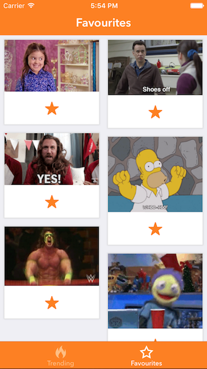

## GifApp

A simple iOS app for viewing GIFs.

  
   

## Features

View trending gifs. Search by keyward, and favourite specific gifs as well. Includes pagination for efficient loading. 

## Architecture

Built using MVVM design pattern, and RXSwift

## Motivation

Created for a job interview

## Installation

Provide code examples and explanations of how to get the project.

## API Reference

GiphySwift, FLAnimatedImage, RxSwift, RxCocoa
